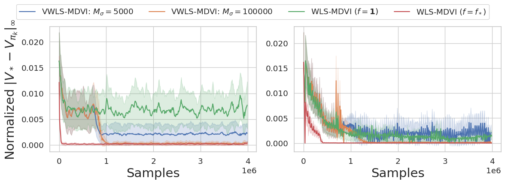

# Official Implementation of Variance-Weighted Least-Squares MDVI (VWLS-MDVI) [Experiments in Section 7.1]

This repository is the official implementation of VWLS-MDVI proposed in [Regularization and Variance-Weighted Regression Achieves Minimax Optimality in Linear MDPs: Theory and Practice](TODO).

* You can see the implementation in [VWLS-MDVI-Experiment.ipynb](VWLS-MDVI-Experiment.ipynb).




## Requirements

```bash
# make sure you are in Variance-Weighted-MDVI/VWLS-MDVI
poetry install
```

## Run Experiments and Plot the results

Run all the cells in [VWLS-MDVI-Experiment.ipynb](VWLS-MDVI-Experiment.ipynb)
